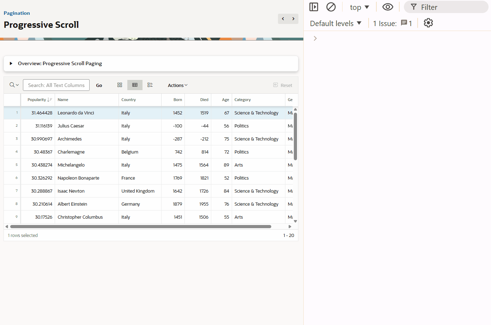
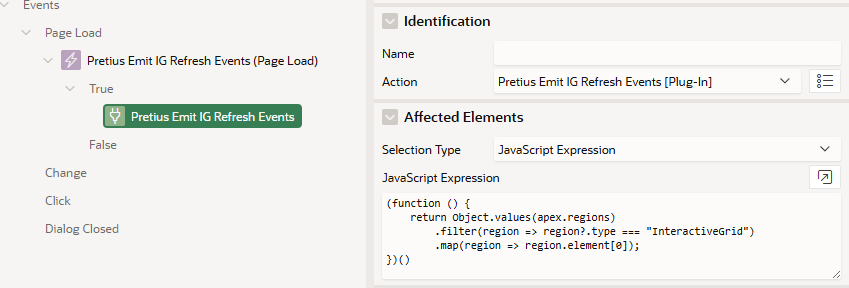

# Pretius Emit IG Refresh Events

An Oracle APEX Dynamic Action plugin that emits consistent `apexbeforerefresh` and `apexafterrefresh` events for Interactive Grid regions, including IG refresh paths (paging, report changes, model fetches, and edit/save transitions).

## Preview

[](assets/preview.gif)


## Features

- Emits reliable refresh lifecycle events for Interactive Grid regions
- Works across common IG flows: pagination, report switch, model refresh/fetch, and save
- Guards against duplicate refresh cycles during report changes
- Handles edit-mode transitions to avoid broken before/after pairs
- Supports multi-region initialization from one Dynamic Action
- Includes optional startup/initialization cycle behavior
- Includes trace/debug helpers for diagnosis

## Installation

### Import via APEX Builder

1. Navigate to **Shared Components** > **Plug-ins**
2. Click **Import**
3. Upload `plugin/dynamic_action_plugin_pretius_apex_emit_ig_refresh_events.sql`
4. Follow the import wizard
5. Confirm plugin name: **Pretius Emit IG Refresh Events**

## Recommended Usage

The recommended approach is to initialize the plugin once on **Global Page (Page 0)** and target all Interactive Grids.

### Step 1: Add plugin initializer on Page 0

[](assets/config.png)

Create Dynamic Action event:

- **Name:** `Pretius Emit IG Refresh Events  (Page Load)`
- **Event:** `Page Load` 

Add True action:

- **Action:** `Pretius Emit IG Refresh Events`
- **Affected Elements Type:** `JavaScript Expression`
- **Affected Elements:**

    ```javascript
    (function () {
        return Object.values(apex.regions)
            .filter(region => region?.type === "InteractiveGrid")
            .map(region => region.element[0]);
    })()
    ```

This initializes all IG regions found on the page using one action.

#### Alternatively 
Create a **Page Load** Dynamic Action event calling `Pretius Emit IG Refresh Events [Plug-in]` with the **Affected Elements Type** set to `Region`

### Step 2: Add a Region Dynamic Action for Before Refresh

Create Dynamic Action event:

- **Name:** `Before Refresh`
- **Custom Event:** `Before Refresh`
- **Selection Type:** `Region`
- **Region*:** `Your IG Region`

Add a True action (example):

```javascript
console.log("Before : " + this.data.action + " (" + this.data.reason + ") : " + this.triggeringElement.id);
```

### Step 3: Add a Region  Dynamic Action for After Refresh

Create Dynamic Action event:

- **Name:** `After Refresh`
- **Custom Event:** `After Refresh`
- **Selection Type:** `Region`
- **Region*:** `Your IG Region`

Add a True action (example):

```javascript
console.log("After : " + this.data.action + " (" + this.data.reason + ") : " + this.triggeringElement.id);
```

### Summary

- Put the `Pretius Emit IG Refresh Events` Plugin on **Page 0** so all pages with IG regions will emit the Before/After Refresh events
- Keep listener DAs on Pages/Regions where you want to catch the Before/After Refresh events

## Event Payload

When the plugin emits `apexbeforerefresh` / `apexafterrefresh`, `this.data` includes useful metadata:

| Property | Description |
|----------|-------------|
| `plugin` | Plugin internal name (`pretiusEmitIgRefreshEvents`) |
| `regionId` | Region static ID |
| `phase` | `before` or `after` |
| `cycleId` | Refresh-cycle counter per region. One cycle starts at `apexbeforerefresh` and ends at the matching `apexafterrefresh`; both events share the same `cycleId`. |
| `action` | Stable cycle classification (`change-report`, `page-change`, `manual-refresh`, `initial-load`, etc.) |
| `cycleReason` | Reason captured when the cycle started (same for before/after in one cycle) |
| `reason` | Phase-level internal detail (can differ between before and after in the same cycle, e.g. `page.change` then `model.addData`) |
| `force` | Whether completion was force-finished |
| `timestamp` | ISO timestamp |
| `pending` | Whether a cycle is currently pending |
| `expectingRefresh` | Whether refresh is expected next |
| `startupEventGuard` | Startup guard state |
| `initialLoadPending` | Initial-load state |
| `modelStats` | Snapshot of IG model state |

### `action` vs `reason`

- Use `action` in Dynamic Action logic. It is the stable, cycle-level label.
- Use `reason` for diagnostics/tracing. It is a low-level signal and may differ by phase.
- Use `cycleReason` if you need the cycle start cause while still logging detailed `reason`.

## Fire on Initialization

Important: Keep all Dynamic Actions `Fire on Initialization` to disabled. The Plugin will ensure that the  IG load will initially emit on page load.

## JavaScript API

The plugin exposes `window.pretiusEmitIgRefreshEvents`:

- `render()`
- `activate(selectors, options)`
- `getVersion()`
- `destroy(regionId)`
- `clearTrace()`
- `getTrace()`
- `enableDebug()`
- `disableDebug()`
- `setDebugOptions(options)`
- `getDebugOptions()`

### `activate(selectors, options)` examples

`activate(...)` is provided So that you can use the pretiusEmitIgRefreshEvents.js JavaScript file within your own Interactive Grid Based plugins and then activate it using this command. If doing it this way, it is recommended to change the file to rename the JavaScript namespace. 

`activate(...)` returns the number of IG regions successfully initialized.

<details>
<summary><strong>activate(...) Usage Instructions</strong></summary>

First load the Plugin on the page with a `Client Condition` of type `JavaScript Expression` of the following. This false expression will ensure that the Plugin files are available, however they will be activated manually.

```javascript
'activation'=='manual'
```

Then Initialize one IG region by static ID selector:

```javascript
pretiusEmitIgRefreshEvents.activate("#emp_ig");
```

Initialize multiple IG regions by selectors:

```javascript
pretiusEmitIgRefreshEvents.activate(["#emp_ig", "#dept_ig"]);
```

Initialize all IG regions on the current page:

```javascript
pretiusEmitIgRefreshEvents.activate(function () {
    return Object.values(apex.regions)
        .filter(function (region) {
            return region && region.type === "InteractiveGrid";
        })
        .map(function (region) {
            return region.element[0];
        });
});
```

Initialize with explicit options:

```javascript
pretiusEmitIgRefreshEvents.activate("#emp_ig", {
    executeOnPageInit: true,
    browserEvent: "load"
});
```

</details>


## Debugging

Enable plugin debug from browser console:

```javascript
pretiusEmitIgRefreshEvents.enableDebug();
pretiusEmitIgRefreshEvents.setDebugOptions({ verboseSettle: true });
```

Inspect trace buffer:

```javascript
pretiusEmitIgRefreshEvents.getTrace();
```

Disable debug:

```javascript
pretiusEmitIgRefreshEvents.disableDebug();
```

## Important Information

This plugin uses **runtime monkey patching** of Interactive Grid internals to guarantee consistent `apexbeforerefresh` & `apexafterrefresh` behavior.

### How invasive is this?

The patching is **moderately to highly invasive** because it hooks into private Interactive Grid and model methods (not public, version-stable APIs) and wraps core runtime behavior around refresh, paging, selection/edit transitions, and report switching.

Because these are internal APIs, Oracle APEX upgrades can change method names, call timing, arguments, or produce side effects without notice.

As a result, **APEX upgrades may partially or fully break this plugin**.


## Compatibility

- Oracle APEX: developed against `24.2.x`
- Plugin version in code: `24.2.1`
- Oracle DB: All versions supported by Oracle APEX `24.2.x`

## License

MIT (see `LICENSE`)
